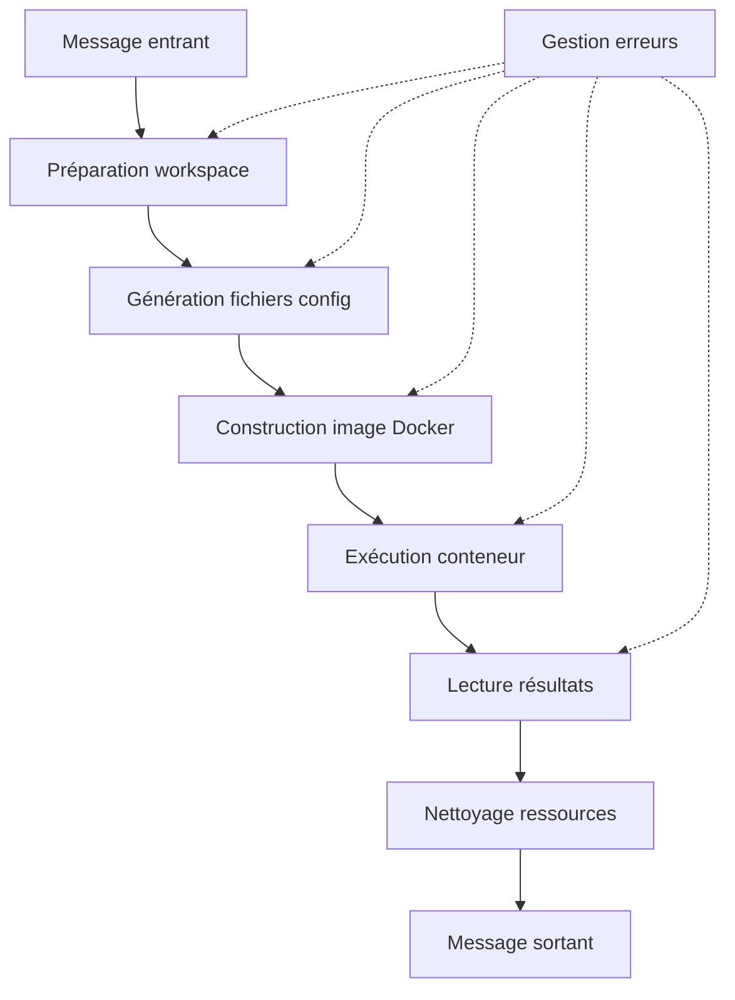

# Python Container Node for Node-RED

## 📋 Table des matières

- [Vue d'ensemble](#vue-densemble)
- [Architecture technique](#architecture-technique)
- [Installation et prérequis](#installation-et-prérequis)
- [Configuration](#configuration)
- [Utilisation](#utilisation)
- [API et contexte d'exécution](#api-et-contexte-dexécution)
- [Gestion des erreurs](#gestion-des-erreurs)
- [Performance et optimisation](#performance-et-optimisation)
- [Sécurité](#sécurité)
- [Dépannage](#dépannage)
- [Exemples d'utilisation](#exemples-dutilisation)

## 🎯 Vue d'ensemble

Le **Python Container Node** est un nœud personnalisé pour Node-RED qui permet l'exécution de code Python arbitraire dans des conteneurs Docker isolés. Ce module résout le problème de l'exécution sécurisée et reproductible de scripts Python avec des dépendances spécifiques dans un environnement Node.js.

### Problème résolu

- **Isolation des dépendances** : Chaque script Python s'exécute avec ses propres bibliothèques
- **Sécurité** : Isolation complète du système hôte via Docker
- **Reproductibilité** : Environnements d'exécution cohérents et versionnés
- **Interopérabilité** : Passage de données seamless entre Node-RED et Python

### Cas d'usage typiques

- Traitement de données scientifiques (NumPy, Pandas, SciPy)
- Apprentissage automatique et IA (TensorFlow, PyTorch, scikit-learn)
- Analyse d'images et vision par ordinateur (OpenCV, PIL)
- Traitement de données géospatiales (GeoPandas, Shapely)
- APIs et intégrations spécialisées nécessitant des bibliothèques Python

## 🏗 Architecture technique

### Flux d'exécution



### Architecture des fichiers

```
/tmp/python-exec-{uuid}/
├── Dockerfile              # Image personnalisée
├── requirements.txt         # Dépendances Python
├── script.py               # Code utilisateur + wrapper
├── input.json              # Données d'entrée
└── output.json             # Résultats d'exécution
```

### Stack technologique

- **Runtime** : Node.js avec Node-RED framework
- **Containerisation** : Docker Engine
- **Exécution Python** : Images Docker officielles Python
- **Communication** : JSON pour sérialisation des données
- **Isolation** : Conteneurs Docker éphémères

## 🔧 Installation et prérequis

### Prérequis système

1. **Docker Engine** >= 20.10.0
   ```bash
   # Installation Ubuntu/Debian
   curl -fsSL https://get.docker.com -o get-docker.sh
   sh get-docker.sh
   
   # Vérification
   docker --version
   docker run hello-world
   ```

2. **Node-RED** >= 3.0.0
   ```bash
   npm install -g node-red
   ```

3. **Permissions Docker**
   ```bash
   # Ajouter l'utilisateur au groupe docker
   sudo usermod -aG docker $USER
   # Redémarrer la session
   ```

### Installation du module

1. **Copier les fichiers dans le répertoire Node-RED**
   ```
   ~/.node-red/nodes/
   ├── python-container.js     # Code backend
   └── python-container.html   # Interface frontend
   ```

2. **Redémarrer Node-RED**
   ```bash
   node-red-restart
   # ou
   pm2 restart node-red
   ```

3. **Vérification de l'installation**
   - Le nœud "Python Container" apparaît dans la palette "function"
   - Icône bleue avec logo Python

## ⚙️ Configuration

### Onglet Configuration

#### Nom du nœud
- **Champ** : `name`
- **Type** : String (optionnel)
- **Description** : Nom affiché dans le flow pour identification
- **Exemple** : "Analyse données capteurs"

#### Image Docker
- **Champ** : `containerImage`
- **Type** : String
- **Valeur par défaut** : `python:3.9-slim`
- **Description** : Image Docker de base pour l'environnement Python
- **Exemples** :
  ```
  python:3.9-slim          # Léger, recommandé
  python:3.11              # Version complète
  python:3.12-alpine       # Ultra-léger
  jupyter/scipy-notebook   # Stack scientifique
  tensorflow/tensorflow    # Machine Learning
  ```

#### Bibliothèques Python
- **Champ** : `pythonLibraries`
- **Type** : Textarea
- **Format** : Une bibliothèque par ligne ou séparées par virgules
- **Description** : Dépendances Python à installer via pip
- **Exemples** :
  ```
  requests
  pandas>=1.3.0
  numpy
  matplotlib
  scikit-learn==1.1.0
  ```

#### Timeout d'exécution
- **Champ** : `timeout`
- **Type** : Number (ms)
- **Valeur par défaut** : 30000 (30 secondes)
- **Plage** : 1000-300000 ms
- **Description** : Temps maximum d'exécution avant interruption

### Onglet Code Python

#### Éditeur de code
- **Éditeur** : ACE Editor avec syntaxe Python
- **Fonctionnalités** :
  - Coloration syntaxique
  - Autocomplétion
  - Vérification d'erreurs
  - Recherche/remplacement (Ctrl+F)
  - Pliage de code

#### Exemples prédéfinis
- **Traitement simple** : Transformation basique de données
- **Traitement JSON** : Manipulation d'objets complexes
- **Traitement avancé** : Utilisation de pandas/numpy
- **Gestion de fichiers** : Lecture/écriture de fichiers
- **Commandes système** : Exécution de commandes shell

### Onglet Avancé

#### Réutilisation de conteneurs
- **Champ** : `reuseContainer`
- **Type** : Boolean
- **Description** : Cache les images Docker pour améliorer les performances
- **Impact** : Réduction du temps de construction de 5-30 secondes

#### Limites de ressources
- **Mémoire maximale** : `maxMemory` (ex: 512m, 1g, 2048m)
- **CPUs maximum** : `maxCpus` (ex: 1, 0.5, 2)
- **Description** : Prévient la consommation excessive de ressources

#### Isolation réseau
- **Champ** : `networkIsolation`
- **Type** : Boolean
- **Valeur par défaut** : true
- **Description** : Bloque l'accès réseau pour sécurité renforcée

## 📝 Utilisation

### Variables d'entrée disponibles

Le contexte d'exécution Python dispose automatiquement des variables suivantes :

```python
# Variables principales
payload          # Données du message entrant (any type)
topic           # Sujet du message (string)
timestamp       # Horodatage ISO 8601 (string)
previous_result # Alias pour payload (any type)

# Métadonnées d'exécution
execution_id    # ID unique d'exécution (string)
node_id        # ID du nœud Node-RED (string)
original_message # Propriétés complètes du message (dict)
```

### Variables de sortie

Le script Python doit définir les variables suivantes pour le résultat :

```python
# Obligatoire
result = "valeur de sortie"  # Devient msg.payload

# Optionnel
output_topic = "nouveau/topic"    # Devient msg.topic
additional_data = {"key": "value"} # Ajouté à msg.additionalData
```

### Fonctions utilitaires

#### Journalisation
```python
log(message, level='info')
# Niveaux : 'info', 'warning', 'error', 'debug'
# Exemple :
log("Traitement démarré", "info")
log("Attention: données manquantes", "warning")
```

#### Gestion de fichiers
```python
# Sauvegarder un fichier
save_file("results.json", json.dumps(data))

# Lire un fichier
content = read_file("data.txt")
if content:
    lines = content.split('\n')
```

#### Commandes système
```python
# Exécuter une commande
result = run_command("ls -la")
if result and result['returncode'] == 0:
    print(result['stdout'])
```

## 🔌 API et contexte d'exécution

### Structure du message d'entrée

```javascript
{
  "payload": any,           // Données principales
  "topic": string,          // Sujet/canal
  "_msgid": string,         // ID unique du message
  "timestamp": string,      // Horodatage
  // ... autres propriétés personnalisées
}
```

### Structure du message de sortie

```javascript
{
  "payload": any,              // Résultat du script Python
  "topic": string,             // Topic original ou modifié
  "pythonOutput": string,      // stdout du script Python
  "pythonErrors": string,      // stderr du script Python
  "executionId": string,       // ID d'exécution
  "executionTimestamp": string, // Timestamp de fin
  "additionalData": object     // Données supplémentaires
}
```

### Cycle de vie d'exécution

1. **Préparation** (100-200ms)
   - Création workspace temporaire
   - Génération des fichiers de configuration
   - Sérialisation des données d'entrée

2. **Construction** (2-30s selon cache)
   - Construction de l'image Docker personnalisée
   - Installation des dépendances Python
   - Optimisation des couches Docker

3. **Exécution** (variable)
   - Lancement du conteneur
   - Exécution du script Python
   - Capture des résultats

4. **Finalisation** (50-100ms)
   - Lecture des fichiers de sortie
   - Nettoyage des ressources temporaires
   - Construction du message de sortie

## ❌ Gestion des erreurs

### Types d'erreurs

#### Erreurs de préparation
```
Erreur de préparation: ENOENT: no such file or directory
```
- **Cause** : Problème de permissions ou d'espace disque
- **Solution** : Vérifier les permissions `/tmp` et l'espace disponible

#### Erreurs de construction Docker
```
Erreur de construction: failed to solve with frontend dockerfile.v0
```
- **Causes** : Image de base invalide, dépendances introuvables
- **Solutions** : 
  - Vérifier la disponibilité de l'image Docker
  - Tester la connectivité réseau
  - Valider la syntaxe des requirements

#### Erreurs d'exécution Python
```
Erreur Python: NameError: name 'undefined_variable' is not defined
```
- **Cause** : Erreur dans le code Python utilisateur
- **Solution** : Déboguer le code Python avec les logs

#### Timeout d'exécution
```
Timeout d'exécution atteint
```
- **Cause** : Script trop lent ou boucle infinie
- **Solutions** :
  - Augmenter le timeout
  - Optimiser le code Python
  - Vérifier les boucles infinies

### Debugging

#### Activer les logs détaillés
```javascript
// Dans settings.js de Node-RED
logging: {
    console: {
        level: "debug",
        metrics: false,
        audit: false
    }
}
```

#### Analyser les logs Python
```python
import sys
print("Debug info", file=sys.stderr)  # Visible dans pythonErrors
log("Processing step 1")               # Avec timestamp
```

## 🚀 Performance et optimisation

### Métriques de performance

| Opération | Sans cache | Avec cache | Optimisation |
|-----------|------------|------------|--------------|
| Image simple (python:3.9-slim) | 3-5s | 0.1s | Cache Docker |
| Avec pandas/numpy | 15-30s | 0.1s | Cache + layers |
| Première exécution | Variable | N/A | Pre-pull images |

### Optimisations recommandées

#### 1. Réutilisation de conteneurs
```javascript
// Configuration recommandée
reuseContainer: true  // Active le cache
```

#### 2. Images optimisées
```dockerfile
# Préférer les images slim
python:3.9-slim      # 45MB vs 885MB pour python:3.9

# Images spécialisées
jupyter/scipy-notebook   # Stack scientifique pré-installé
tensorflow/tensorflow    # ML pré-configuré
```

#### 3. Gestion des dépendances
```txt
# requirements.txt optimisé
pandas>=1.3.0,<2.0.0    # Contraintes de version
numpy                    # Pas de version si stable
scikit-learn==1.1.0     # Version exacte si critique
```

#### 4. Code Python optimisé
```python
# Éviter les imports coûteux si non utilisés
if processing_needed:
    import heavy_library

# Utiliser les fonctions vectorisées
result = np.array(data).sum()  # Plus rapide que sum(data)
```

### Monitoring des ressources

```bash
# Surveiller l'utilisation Docker
docker stats

# Nettoyer les images orphelines
docker system prune -f

# Surveiller l'espace disque /tmp
df -h /tmp
```

## 🔒 Sécurité

### Isolation et containment

#### Isolation des processus
- Chaque exécution dans un conteneur éphémère
- Pas d'accès au système de fichiers hôte
- Isolation des processus et namespaces

#### Limitations de ressources
```javascript
// Configuration sécurisée
maxMemory: "512m",     // Limite mémoire
maxCpus: "1",          // Limite CPU
networkIsolation: true // Pas d'accès réseau
```

#### Utilisateur non-root
```dockerfile
# Dans le conteneur
RUN useradd -m -u 1000 pythonuser
USER pythonuser
```

### Bonnes pratiques sécuritaires

#### 1. Validation des entrées
```python
# Valider les données d'entrée
if not isinstance(payload, (dict, list, str, int, float)):
    raise ValueError("Type de données non supporté")

# Sanitiser les chaînes
import re
if isinstance(payload, str):
    clean_payload = re.sub(r'[^\w\s-]', '', payload)
```

#### 2. Gestion des secrets
```python
# JAMAIS hardcoder des secrets
# api_key = "sk-1234..."  # ❌ MAUVAIS

# Utiliser des variables d'environnement ou Node-RED context
api_key = os.environ.get('API_KEY')  # ✅ BON
```

#### 3. Limitation des capacités
```python
# Éviter les opérations dangereuses
# os.system("rm -rf /")     # ❌ DANGEREUX
# subprocess.call([...])    # ❌ RISQUÉ

# Utiliser run_command() qui est sécurisée
result = run_command("safe_command")  # ✅ BON
```

### Audit et monitoring

```bash
# Logs de sécurité Docker
sudo journalctl -u docker

# Surveiller les conteneurs actifs
docker ps

# Audit des images
docker images --filter "dangling=true"
```

## 🛠 Dépannage

### Problèmes courants

#### Docker non accessible
**Symptôme** :
```
Error: connect ENOENT /var/run/docker.sock
```
**Solutions** :
1. Vérifier que Docker est démarré : `sudo systemctl status docker`
2. Permissions utilisateur : `sudo usermod -aG docker $USER`
3. Redémarrer la session utilisateur

#### Manque d'espace disque
**Symptôme** :
```
Error: no space left on device
```
**Solutions** :
1. Nettoyer Docker : `docker system prune -af`
2. Nettoyer /tmp : `sudo rm -rf /tmp/python-exec-*`
3. Augmenter l'espace disque

#### Timeout systématique
**Symptôme** :
```
Timeout d'exécution atteint
```
**Diagnostic** :
```python
import time
start = time.time()
# Votre code ici
print(f"Durée: {time.time() - start}s", file=sys.stderr)
```

#### Bibliothèques non trouvées
**Symptôme** :
```
ModuleNotFoundError: No module named 'pandas'
```
**Solutions** :
1. Vérifier requirements.txt
2. Tester l'installation : `pip install pandas`
3. Utiliser des versions compatibles

### Outils de diagnostic

#### Script de test
```python
# test_environment.py
import sys
import json
import os

print("=== Test environnement ===", file=sys.stderr)
print(f"Python version: {sys.version}", file=sys.stderr)
print(f"Working directory: {os.getcwd()}", file=sys.stderr)
print(f"Available files: {os.listdir('/app')}", file=sys.stderr)

# Test des variables
print(f"Payload type: {type(payload)}", file=sys.stderr)
print(f"Payload value: {payload}", file=sys.stderr)

# Test des fonctions
try:
    log("Test logging function")
    save_file("test.txt", "Hello World")
    content = read_file("test.txt")
    print(f"File test: {content}", file=sys.stderr)
except Exception as e:
    print(f"Function test error: {e}", file=sys.stderr)

result = "Environment test completed"
```

#### Monitoring avancé
```bash
#!/bin/bash
# monitor_node.sh
echo "=== Node-RED Python Container Monitor ==="
echo "Docker status: $(systemctl is-active docker)"
echo "Available images: $(docker images --format 'table {{.Repository}}:{{.Tag}}\t{{.Size}}')"
echo "Running containers: $(docker ps --format 'table {{.Names}}\t{{.Status}}')"
echo "Disk usage /tmp: $(du -sh /tmp/python-exec-* 2>/dev/null | wc -l) workspaces"
echo "Memory usage: $(free -h | grep Mem)"
```

## 📚 Exemples d'utilisation

### Exemple 1 : Analyse de données IoT

**Contexte** : Traiter les données de capteurs avec pandas

```python
import pandas as pd
import numpy as np
from datetime import datetime

log("Analyse des données IoT démarrée")

# Conversion des données capteurs
if isinstance(payload, list):
    df = pd.DataFrame(payload)
    
    # Calculs statistiques
    stats = {
        'temperature_moyenne': df['temperature'].mean(),
        'humidite_max': df['humidity'].max(),
        'nb_mesures': len(df),
        'periode': f"{df['timestamp'].min()} à {df['timestamp'].max()}"
    }
    
    # Détection d'anomalies
    temp_std = df['temperature'].std()
    temp_mean = df['temperature'].mean()
    anomalies = df[
        (df['temperature'] > temp_mean + 2*temp_std) |
        (df['temperature'] < temp_mean - 2*temp_std)
    ]
    
    result = {
        'statistiques': stats,
        'anomalies': anomalies.to_dict('records'),
        'statut': 'analysé'
    }
    
    # Sauvegarde pour historique
    save_file('analyse_iot.json', pd.DataFrame([stats]).to_json())
    
    log(f"Analyse terminée: {len(anomalies)} anomalies détectées")
    
else:
    result = {'erreur': 'Format de données invalide'}
    log("Erreur: données non conformes", "error")

output_topic = f"iot/analysis/{topic}"
```

### Exemple 2 : Vision par ordinateur

**Contexte** : Analyse d'images avec OpenCV

```python
import cv2
import numpy as np
import base64
import json

log("Analyse d'image démarrée")

try:
    # Décoder l'image base64
    if isinstance(payload, dict) and 'image_data' in payload:
        image_data = base64.b64decode(payload['image_data'])
        
        # Sauvegarder l'image temporairement
        save_file('input_image.jpg', image_data)
        
        # Charger avec OpenCV
        image = cv2.imread('/app/input_image.jpg')
        
        if image is not None:
            # Détection de contours
            gray = cv2.cvtColor(image, cv2.COLOR_BGR2GRAY)
            blurred = cv2.GaussianBlur(gray, (5, 5), 0)
            edges = cv2.Canny(blurred, 50, 150)
            
            # Trouver les contours
            contours, _ = cv2.findContours(edges, cv2.RETR_EXTERNAL, cv2.CHAIN_APPROX_SIMPLE)
            
            # Analyser les objets
            objects = []
            for i, contour in enumerate(contours):
                area = cv2.contourArea(contour)
                if area > 100:  # Filtrer les petits objets
                    x, y, w, h = cv2.boundingRect(contour)
                    objects.append({
                        'id': i,
                        'position': {'x': int(x), 'y': int(y)},
                        'taille': {'width': int(w), 'height': int(h)},
                        'surface': float(area)
                    })
            
            # Dessiner les résultats
            result_image = image.copy()
            for obj in objects:
                x, y = obj['position']['x'], obj['position']['y']
                w, h = obj['taille']['width'], obj['taille']['height']
                cv2.rectangle(result_image, (x, y), (x+w, y+h), (0, 255, 0), 2)
            
            # Encoder l'image résultat
            _, buffer = cv2.imencode('.jpg', result_image)
            result_image_b64 = base64.b64encode(buffer).decode()
            
            result = {
                'objets_detectes': len(objects),
                'details_objets': objects,
                'image_analysee': result_image_b64,
                'resolution': {'width': image.shape[1], 'height': image.shape[0]}
            }
            
            save_file('analysis_result.json', json.dumps(result, indent=2))
            log(f"Analyse terminée: {len(objects)} objets détectés")
            
        else:
            result = {'erreur': 'Image non valide'}
            log("Erreur: impossible de charger l'image", "error")
    else:
        result = {'erreur': 'Données image manquantes'}
        log("Erreur: format de données incorrect", "error")

except Exception as e:
    result = {'erreur': f'Erreur de traitement: {str(e)}'}
    log(f"Erreur inattendue: {e}", "error")

output_topic = f"vision/analysis/{topic}"
additional_data = {
    'algorithme': 'opencv_contours',
    'version': '4.5.0'
}
```

### Exemple 3 : Machine Learning avec scikit-learn

**Contexte** : Classification de données avec apprentissage automatique

```python
import pandas as pd
import numpy as np
from sklearn.model_selection import train_test_split
from sklearn.ensemble import RandomForestClassifier
from sklearn.metrics import classification_report, accuracy_score
import joblib
import json

log("Entraînement du modèle ML démarré")

try:
    # Charger les données d'entraînement
    if isinstance(payload, dict) and 'training_data' in payload:
        df = pd.DataFrame(payload['training_data'])
        
        # Préparer les features et targets
        feature_columns = [col for col in df.columns if col != 'target']
        X = df[feature_columns]
        y = df['target']
        
        log(f"Dataset: {len(df)} échantillons, {len(feature_columns)} features")
        
        # Division train/test
        X_train, X_test, y_train, y_test = train_test_split(
            X, y, test_size=0.2, random_state=42
        )
        
        # Entraînement du modèle
        model = RandomForestClassifier(
            n_estimators=100,
            random_state=42,
            max_depth=10
        )
        model.fit(X_train, y_train)
        
        # Évaluation
        y_pred = model.predict(X_test)
        accuracy = accuracy_score(y_test, y_pred)
        report = classification_report(y_test, y_pred, output_dict=True)
        
        # Importance des features
        feature_importance = dict(zip(
            feature_columns,
            model.feature_importances_.tolist()
        ))
        
        # Sauvegarder le modèle
        joblib.dump(model, '/app/trained_model.pkl')
        
        # Prédictions sur nouvelles données si fournies
        predictions = []
        if 'prediction_data' in payload:
            pred_df = pd.DataFrame(payload['prediction_data'])
            pred_results = model.predict(pred_df[feature_columns])
            pred_proba = model.predict_proba(pred_df[feature_columns])
            
            for i, (pred, proba) in enumerate(zip(pred_results, pred_proba)):
                predictions.append({
                    'sample_id': i,
                    'prediction': int(pred),
                    'confidence': float(max(proba)),
                    'probabilities': proba.tolist()
                })
        
        result = {
            'model_performance': {
                'accuracy': float(accuracy),
                'detailed_report': report,
                'feature_importance': feature_importance
            },
            'training_info': {
                'samples_train': len(X_train),
                'samples_test': len(X_test),
                'features_used': feature_columns
            },
            'predictions': predictions
        }
        
        # Sauvegarder les résultats
        save_file('ml_results.json', json.dumps(result, indent=2))
        save_file('model_info.txt', f"Accuracy: {accuracy:.3f}\nFeatures: {feature_columns}")
        
        log(f"Entraînement terminé - Accuracy: {accuracy:.3f}")
        
    else:
        result = {'erreur': 'Données d\'entraînement manquantes'}
        log("Erreur: format de données incorrect", "error")

except Exception as e:
    result = {'erreur': f'Erreur ML: {str(e)}'}
    log(f"Erreur lors de l'entraînement: {e}", "error")

output_topic = f"ml/model/{topic}"
additional_data = {
    'algorithm': 'RandomForest',
    'sklearn_version': '1.1.0',
    'model_saved': '/app/trained_model.pkl'
}
```

### Exemple 4 : Intégration API et web scraping

**Contexte** : Récupération et traitement de données externes

```python
import requests
import json
from bs4 import BeautifulSoup
import pandas as pd
from datetime import datetime
import time

log("Récupération de données externes démarrée")

try:
    # Configuration des APIs depuis le payload
    config = payload.get('api_config', {})
    base_url = config.get('base_url', 'https://api.example.com')
    api_key = config.get('api_key', '')
    
    collected_data = []
    
    # 1. Récupération via API REST
    if 'api_endpoints' in config:
        for endpoint in config['api_endpoints']:
            headers = {'Authorization': f'Bearer {api_key}'}
            
            log(f"Appel API: {endpoint}")
            response = requests.get(f"{base_url}/{endpoint}", headers=headers, timeout=10)
            
            if response.status_code == 200:
                api_data = response.json()
                collected_data.extend(api_data.get('data', []))
                log(f"API {endpoint}: {len(api_data.get('data', []))} éléments récupérés")
            else:
                log(f"Erreur API {endpoint}: {response.status_code}", "warning")
            
            time.sleep(1)  # Rate limiting
    
    # 2. Web scraping si configuré
    if 'scraping_urls' in config:
        for url_config in config['scraping_urls']:
            url = url_config['url']
            selector = url_config.get('selector', 'p')
            
            log(f"Scraping: {url}")
            response = requests.get(url, timeout=10)
            
            if response.status_code == 200:
                soup = BeautifulSoup(response.content, 'html.parser')
                elements = soup.select(selector)
                
                scraped_data = []
                for elem in elements[:10]:  # Limiter à 10 éléments
                    scraped_data.append({
                        'text': elem.get_text().strip(),
                        'tag': elem.name,
                        'url_source': url
                    })
                
                collected_data.extend(scraped_data)
                log(f"Scraping {url}: {len(scraped_data)} éléments extraits")
            
            time.sleep(2)  # Rate limiting pour scraping
    
    # 3. Traitement et analyse des données collectées
    if collected_data:
        df = pd.DataFrame(collected_data)
        
        # Nettoyage des données
        if 'text' in df.columns:
            df['text_length'] = df['text'].str.len()
            df['word_count'] = df['text'].str.split().str.len()
        
        # Statistiques descriptives
        stats = {
            'total_records': len(df),
            'data_sources': len(config.get('api_endpoints', [])) + len(config.get('scraping_urls', [])),
            'collection_timestamp': datetime.now().isoformat()
        }
        
        # Ajout de statistiques spécifiques selon les colonnes
        if 'text_length' in df.columns:
            stats.update({
                'avg_text_length': float(df['text_length'].mean()),
                'max_text_length': int(df['text_length'].max()),
                'total_words': int(df['word_count'].sum())
            })
        
        # Sauvegarde des données
        save_file('collected_data.json', df.to_json(orient='records', indent=2))
        save_file('collection_stats.json', json.dumps(stats, indent=2))
        
        result = {
            'status': 'success',
            'data': collected_data[:100],  # Limiter la sortie
            'statistics': stats,
            'full_data_available': len(collected_data) > 100
        }
        
        log(f"Collection terminée: {len(collected_data)} éléments traités")
        
    else:
        result = {
            'status': 'no_data',
            'message': 'Aucune donnée collectée',
            'configuration': config
        }
        log("Aucune donnée collectée", "warning")

except requests.RequestException as e:
    result = {'erreur': f'Erreur réseau: {str(e)}'}
    log(f"Erreur de requête: {e}", "error")

except Exception as e:
    result = {'erreur': f'Erreur de traitement: {str(e)}'}
    log(f"Erreur inattendue: {e}", "error")

output_topic = f"data/external/{topic}"
additional_data = {
    'collection_method': 'api_scraping',
    'libraries_used': ['requests', 'beautifulsoup4', 'pandas'],
    'rate_limited': True
}
```

## 🔧 Configuration Node-RED recommandée

### settings.js optimal

```javascript
module.exports = {
    // Timeout pour les nœuds
    functionGlobalContext: {
        // Variables globales disponibles
    },
    
    // Configuration des logs
    logging: {
        console: {
            level: "info",
            metrics: false,
            audit: false
        },
        file: {
            level: "info",
            filename: "/var/log/node-red/node-red.log",
            maxFiles: 5,
            maxSize: "10MB"
        }
    },
    
    // Limites de performance
    runtimeState: {
        enabled: false,
        ui: false
    },
    
    // Sécurité
    adminAuth: {
        type: "credentials",
        users: [{
            username: "admin",
            password: "$2b$08$...",  // Hash bcrypt
            permissions: "*"
        }]
    },
    
    // Optimisations pour conteneurs
    editorTheme: {
        projects: {
            enabled: false
        }
    }
}
```

### Monitoring et maintenance

#### Script de maintenance automatique

```bash
#!/bin/bash
# maintain_python_containers.sh

echo "=== Maintenance Python Container Node ==="
date

# Nettoyer les workspaces anciens (> 1 jour)
find /tmp -name "python-exec-*" -type d -mtime +1 -exec rm -rf {} + 2>/dev/null
echo "Workspaces nettoyés: $(find /tmp -name "python-exec-*" -type d | wc -l) restants"

# Nettoyer les images Docker orphelines
docker image prune -f
echo "Images Docker nettoyées"

# Statistiques d'utilisation
echo "Conteneurs actifs: $(docker ps --filter ancestor=python --format '{{.Names}}' | wc -l)"
echo "Images Python: $(docker images --filter reference='python*' --format '{{.Repository}}:{{.Tag}}' | wc -l)"
echo "Espace disque /tmp: $(du -sh /tmp 2>/dev/null)"

# Vérifier la santé de Docker
if ! docker info >/dev/null 2>&1; then
    echo "ALERTE: Docker n'est pas accessible"
    exit 1
fi

echo "Maintenance terminée avec succès"
```

#### Monitoring avec Prometheus (optionnel)

```yaml
# docker-compose.yml pour monitoring
version: '3.8'
services:
  node-exporter:
    image: prom/node-exporter
    ports:
      - "9100:9100"
    volumes:
      - /proc:/host/proc:ro
      - /sys:/host/sys:ro
      - /:/rootfs:ro
    command:
      - '--path.procfs=/host/proc'
      - '--path.sysfs=/host/sys'
      - '--collector.filesystem.ignored-mount-points'
      - '^/(sys|proc|dev|host|etc|rootfs/var/lib/docker/containers|rootfs/var/lib/docker/overlay2|rootfs/run/docker/netns|rootfs/var/lib/docker/aufs)($|/)'

  cadvisor:
    image: gcr.io/cadvisor/cadvisor
    ports:
      - "8080:8080"
    volumes:
      - /:/rootfs:ro
      - /var/run:/var/run:ro
      - /sys:/sys:ro
      - /var/lib/docker/:/var/lib/docker:ro
      - /dev/disk/:/dev/disk:ro
```

## 📊 Métriques et KPIs

### Métriques de performance

| Métrique | Valeur normale | Alerte | Critique |
|----------|----------------|---------|----------|
| Temps construction image | < 30s | > 60s | > 120s |
| Temps exécution Python | < 10s | > 30s | > timeout |
| Utilisation mémoire | < 512MB | > 1GB | > 2GB |
| Espace disque /tmp | < 1GB | > 5GB | > 10GB |
| Nombre conteneurs actifs | < 5 | > 20 | > 50 |

### Indicateurs de qualité

```python
# Code de monitoring intégré
import psutil
import time

# Mesures de performance dans le script Python
start_time = time.time()
memory_start = psutil.Process().memory_info().rss / 1024 / 1024  # MB

# ... votre code Python ...

execution_time = time.time() - start_time
memory_peak = psutil.Process().memory_info().rss / 1024 / 1024  # MB

additional_data = {
    'performance': {
        'execution_time_seconds': round(execution_time, 3),
        'memory_usage_mb': round(memory_peak, 2),
        'memory_delta_mb': round(memory_peak - memory_start, 2)
    }
}
```

## 🚨 Alerting et incidents

### Configuration d'alertes

```javascript
// Dans le flow Node-RED - nœud de monitoring
if (msg.executionTime > 30000) {  // > 30 secondes
    node.warn(`Performance dégradée: ${msg.executionTime}ms`);
}

if (msg.pythonErrors && msg.pythonErrors.includes('OutOfMemoryError')) {
    node.error('Erreur mémoire détectée - vérifier les limites');
}

// Compteur d'erreurs
context.set('error_count', (context.get('error_count') || 0) + 1);
if (context.get('error_count') > 5) {
    node.error('Trop d\'erreurs consécutives - intervention requise');
}
```

### Procédures de récupération

#### Récupération automatique
```javascript
// Auto-retry avec backoff exponentiel
let retryCount = msg.retryCount || 0;
if (retryCount < 3) {
    setTimeout(() => {
        msg.retryCount = retryCount + 1;
        node.send(msg);  // Retry
    }, Math.pow(2, retryCount) * 1000);  // 1s, 2s, 4s
}
```

#### Procédure manuelle d'urgence
```bash
#!/bin/bash
# emergency_cleanup.sh

echo "=== PROCÉDURE D'URGENCE ==="

# Arrêter tous les conteneurs Python
docker ps --filter ancestor=python --format '{{.ID}}' | xargs -r docker kill
echo "Conteneurs Python arrêtés"

# Nettoyer tout le cache
docker system prune -af --volumes
echo "Cache Docker nettoyé"

# Nettoyer /tmp
rm -rf /tmp/python-exec-*
echo "Workspaces nettoyés"

# Redémarrer Docker si nécessaire
if ! docker info >/dev/null 2>&1; then
    sudo systemctl restart docker
    echo "Docker redémarré"
fi

# Redémarrer Node-RED
sudo systemctl restart node-red
echo "Node-RED redémarré"

echo "Procédure d'urgence terminée"
```

## 📈 Évolutions et roadmap

### Fonctionnalités prévues

#### Version 2.0
- **Multi-langage** : Support R, Julia, Rust
- **Orchestration** : Kubernetes backend
- **Cache distribué** : Redis pour cache inter-instances
- **Streaming** : Support des gros datasets

#### Version 2.1
- **GPU Support** : Conteneurs avec CUDA
- **Notebooks** : Intégration Jupyter
- **Debugging** : Mode interactif
- **Templates** : Bibliothèque de scripts pré-configurés

### Migration et compatibilité

```javascript
// Migration automatique des anciennes configurations
function migrateConfig(oldConfig) {
    const newConfig = { ...oldConfig };
    
    // Migration v1.0 -> v2.0
    if (!newConfig.version || newConfig.version < '2.0') {
        newConfig.reuseContainer = false;  // Valeur par défaut
        newConfig.maxMemory = '512m';
        newConfig.version = '2.0';
    }
    
    return newConfig;
}
```

## 🤝 Contribution et support

### Signaler un bug

```markdown
**Template de bug report**

**Version du module** : 1.0.0
**Version Node-RED** : 3.0.2
**Version Docker** : 20.10.17
**OS** : Ubuntu 22.04

**Description du problème** :
[Description claire et concise]

**Étapes pour reproduire** :
1. Configurer le nœud avec...
2. Envoyer un message avec...
3. Observer l'erreur...

**Comportement attendu** :
[Ce qui devrait se passer]

**Logs** :
```
[Logs Node-RED et Docker]
```

**Configuration** :
```json
{
  "pythonLibraries": "...",
  "containerImage": "...",
  // ...
}
```
```

### Demande de fonctionnalité

```markdown
**Template de feature request**

**Problème à résoudre** :
[Quel problème cette fonctionnalité résoudrait-elle ?]

**Solution proposée** :
[Description de la solution idéale]

**Alternatives considérées** :
[Autres approches envisagées]

**Impact** :
- Performance : [Impact estimé]
- Sécurité : [Considérations de sécurité]
- Compatibilité : [Breaking changes ?]
```

### Développement local

```bash
# Setup développement
git clone https://github.com/your-repo/node-red-python-container
cd node-red-python-container

# Installation
npm install

# Tests unitaires
npm test

# Tests d'intégration
npm run test:integration

# Linting
npm run lint

# Build
npm run build
```

---

## 📝 Changelog

### Version 1.0.0 (Actuelle)
- ✅ Exécution Python isolée dans Docker
- ✅ Installation dynamique de dépendances
- ✅ Interface graphique avec éditeur ACE
- ✅ Gestion asynchrone complète
- ✅ Fonctions utilitaires Python
- ✅ Gestion d'erreurs robuste
- ✅ Cache de conteneurs optionnel
- ✅ Limites de ressources configurables

### Version 0.9.0 (Beta)
- ✅ Proof of concept fonctionnel
- ✅ Exécution synchrone de base
- ⚠️ Problèmes de performance
- ⚠️ Gestion d'erreurs limitée

---

**Auteurs** : Équipe de développement Node-RED Python Container
**License** : MIT
**Documentation mise à jour** : Janvier 2025

---

*Ce README constitue la documentation technique complète du module Python Container pour Node-RED. Pour toute question ou problème, consultez la section dépannage ou créez une issue sur le repository du projet.*